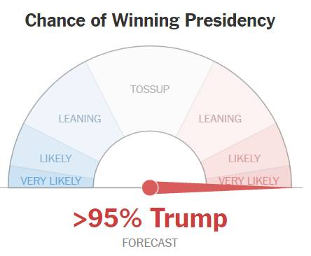

A student's score on a single test is not a definitive measure of student achievement.
But by understanding what a test score means, it is possible to derive useful information 
about your child's achievement. In particular, useful information about your child's
achievement relative to the state's performance standards can be provided.

## How to interpret your child's score

* How likely is it that your child is at/above proficient (state reference/school reference)
* How likely is it that your child is in level 1? (state reference/school reference)
* How likely is it that your child is in level 4? (state reference/school reference)

## Interpretation

## Recommendations
